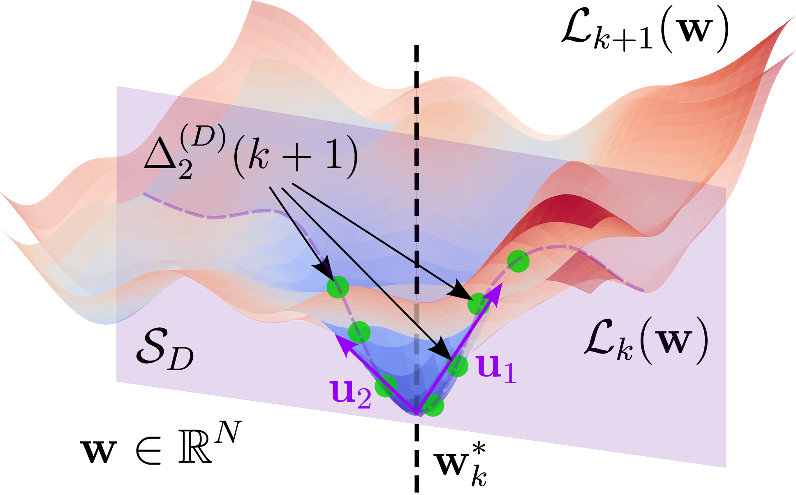

# Curvature Subspaces and the Loss Landscape at Scale

[](paper/main.pdf)
[](code/)

This is the official companion repository for the paper **Curvature Subspaces and the Loss Landscape at Scale** by [Nikita Kiselev](https://kisnikser.github.io/) and [Andrey Grabovoy](https://scholar.google.com/citations?user=ZtI9pgsAAAAJ&hl=en&oi=sra).

<div align="center">
    
</div>

<br>

**Abstract.** We study how local loss geometry evolves as the training set grows, building on landscape increment measures between successive empirical risks. The full-space mean-squared criterion attains an $\mathcal{O}(k^{-2})$ rate but is costly in the ambient dimension when curvature concentrates in a few Hessian directions. We analyze the subspace mean-squared criterion $\Delta_{2}^{(D)}$, restricting increments to the top-$D$ Hessian eigenvectors. Under a local quadratic model we prove an $\mathcal{O}(k^{-2})$ bound with curvature scaling in $D$ rather than $N$, give a spectral expression under optional alignment of principal directions, and describe estimation via Hessian–vector products and Monte Carlo in $\mathbb{R}^{D}$. The current empirical program is centered on NanoGPT-style decoder-only transformers, with a reference Tiny Shakespeare setting, a stronger WikiText-2 validation setting, and reviewer-facing ablations for subspace choice, locality, and eigenspace drift.

## Repository structure

This repository is structured as follows:

- **`code`** — experiment code and plotting; see [`code/README.md`](code/README.md).
- **`paper`** — preprint [`paper/main.pdf`](paper/main.pdf) and LaTeX sources (`main.tex`, `references.bib`, NeurIPS style).

## Citation

If you find our work helpful, please cite us.

```bibtex
@misc{kiselev2026curvaturesubspace,
    title={Curvature Subspaces and the Loss Landscape at Scale},
    author={Kiselev, Nikita and Grabovoy, Andrey},
    year={2026},
    note={Manuscript. NeurIPS submission.}
}
```

## Licence

Our project is MIT licensed. See [LICENSE](LICENSE) for details.
